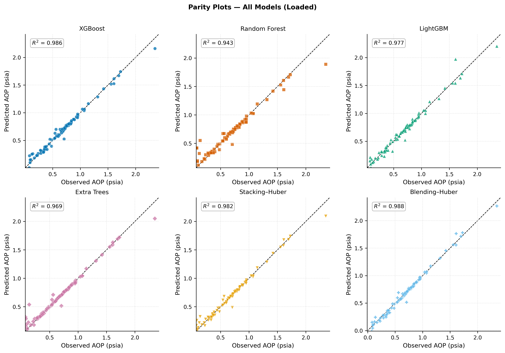
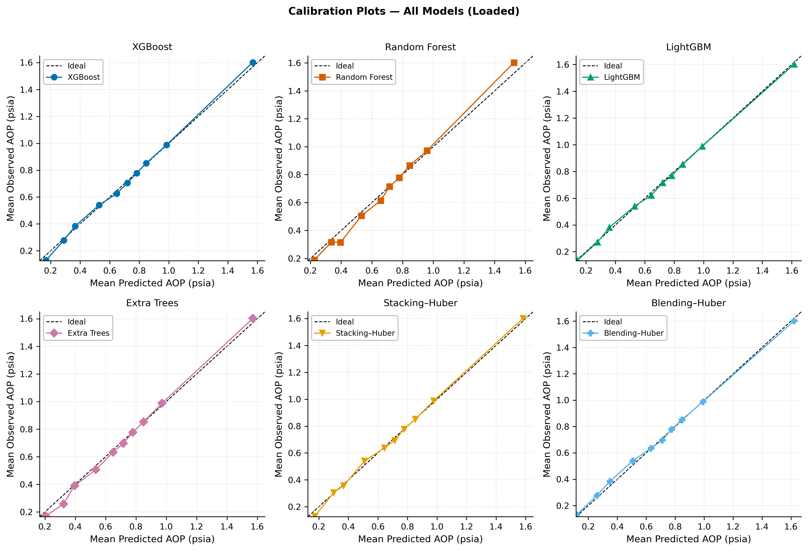
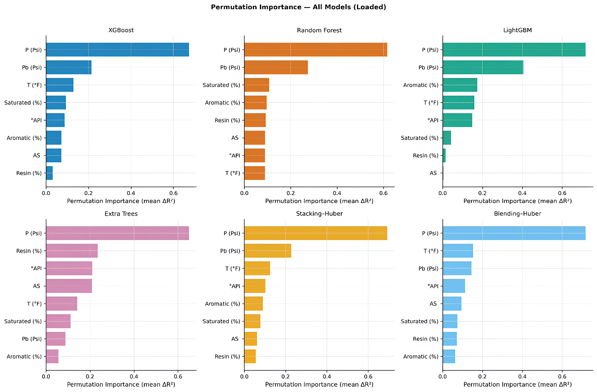

<div align="center">

# Asphaltene Precipitation Amount — Ensemble ML Prediction

*A rigorous machine-learning pipeline for quantitative estimation of **asphaltene precipitation amount** from reservoir fluid composition,*  
*combining gradient-boosted trees, bagging ensembles, and Huber-regularized meta-learners.*

[](https://www.python.org/)
[](https://scikit-learn.org/)
[](https://xgboost.readthedocs.io/)
[](https://optuna.org/)

</div>

---

## Overview

Quantifying the **amount** of asphaltene precipitation as a function of reservoir conditions is a central challenge in flow assurance engineering. While the Asphaltene Onset Pressure (AOP) identifies the thermodynamic boundary at which aggregation begins, the fractional precipitation amount (wt%) governs the severity of deposition and directly informs inhibitor dosing decisions. Accurate, data-driven estimation of this quantity — without relying on computationally expensive equation-of-state tuning — is the objective of this repository.

Six supervised-learning models are trained, tuned, and rigorously compared on a curated experimental dataset. Input features include reservoir pressure, bubble point pressure, SARA compositional descriptors (Saturates, Aromatics, Resins, Asphaltenes), API gravity, and temperature. The target variable is fractional asphaltene precipitation amount (wt%).

---

## Methodology

### Base Learners

Four diverse base models are independently optimised on the training set using **5-fold cross-validation** (R² objective, 50 Optuna trials per model). Each is wrapped in a `Pipeline` with `RobustScaler` to accommodate different feature scales:

<div align="center">

| Model | Library |
|:---:|:---:|
| XGBoost | `xgboost` |
| LightGBM | `lightgbm` |
| Extra Trees | `scikit-learn` |
| Random Forest | `scikit-learn` |

</div>

### Ensemble Strategies

**Stacking Regressor**
- Built with `StackingRegressor(passthrough=True)`, feeding original features alongside base-model predictions to the meta-learner.
- Out-of-fold predictions generated via the same 5-fold CV scheme to prevent data leakage.
- Meta-learner: `HuberRegressor(ε = 1.35, max_iter = 1000)`.

**Blending Regressor**
- Custom `BlendingRegressor` class that holds out a fixed **20%** of training data for meta-learner fitting.
- All base models are retrained on the full training set after meta-learner optimisation.
- Meta-learner: `HuberRegressor(ε = 1.35, max_iter = 1000)`.

### Hyperparameter Optimisation

All base models are tuned with **Optuna** (50 trials per model) over the most influential hyperparameter subspaces. Best-found configurations are carried forward into the final ensemble.

---

## Results

All six models are evaluated on a fully held-out test set. Performance is reported across R², MSE, and MAE.

<div align="center">

| Model | R² | MSE | MAE |
|:---|:---:|:---:|:---:|
| **Blending-Huber** | **0.988** | **0.002** | **0.0298** |
| XGBoost | 0.986 | 0.003 | 0.0321 |
| Stacking-Huber | 0.982 | 0.003 | 0.0314 |
| LightGBM | 0.977 | 0.004 | 0.0399 |
| Extra Trees | 0.969 | 0.006 | 0.0313 |
| Random Forest | 0.943 | 0.010 | 0.0489 |

</div>

**Blending-Huber** achieves the best overall result with an R² of **0.988** and MAE of **0.0298**, followed closely by XGBoost as the strongest standalone base learner. Stacking-Huber ranks third with performance nearly equivalent to XGBoost. Random Forest records the weakest result across all metrics — a pattern that, as in the AOP task, reflects its tendency toward mean-regression under distributional imbalance.

> **On the Random Forest MAE–R² divergence:** Random Forest's relatively moderate R² (0.943) coexists with a disproportionately high MAE (0.0489). A visible tendency to overpredict at low observed values and cluster predictions toward the center of the distribution — characteristic of bagging-ensemble variance shrinkage — directly explains this discrepancy and is confirmed by calibration analysis below.

---

## Visualisations

### 1 · Parity Plot — Observed vs. Predicted Precipitation Amount

Parity plots for all six models compare predicted precipitation amount against measured values on the test set. The 45° identity line marks perfect prediction; deviations reflect systematic bias or random scatter.

XGBoost and Blending-Huber display the tightest alignment with the identity line across the full precipitation range, with scatter distributed symmetrically around the diagonal and no discernible directional bias at any precipitation level. Stacking-Huber behaves comparably, with only a single high-value outlier at the upper end of the range — a deviation that does not reflect a systematic pattern. LightGBM and Extra Trees show slightly wider scatter, most visible in the low-precipitation regime (below ~0.4 wt%), where small absolute deviations translate into proportionally larger relative errors. Random Forest exhibits the broadest dispersion, with visible overprediction at low observed values and clustering toward the center of the distribution.

<div align="center">
  
  <br/>
  <sub><b>Figure 1.</b> Parity plots for all six models. Points on the dashed diagonal indicate perfect prediction.</sub>
</div>

---

### 2 · Calibration by Predicted Deciles

The test set is partitioned into **10 equal deciles** based on predicted precipitation amount. Mean predicted vs. mean observed values are plotted per decile. Alignment with the diagonal indicates conditional unbiasedness across the full prediction range.

XGBoost stands out with near-perfect decile calibration: mean observed precipitation closely tracks mean predicted values across the entire range, with only negligible deviation at the lowest decile. Blending-Huber and Stacking-Huber produce nearly identical calibration curves, both closely following the ideal diagonal from the lowest to the highest predicted values — confirming that the ensembles' strong MAE reflects genuine probabilistic reliability rather than accuracy concentrated in a narrow range. Extra Trees and LightGBM show minor oscillation in mid-range deciles without systematic directional bias.

Random Forest's calibration curve tells a different story. A pronounced **S-shaped departure** from the diagonal is visible: in the lower deciles, mean observed values consistently exceed predictions, while in the upper deciles the model overshoots. This is the calibration signature of ensemble mean-regression — the model pulls extreme predictions toward the center of the training distribution. Applied without post-hoc correction, Random Forest would systematically underestimate precipitation in low-deposition conditions and overestimate it at high deposition levels, both of which carry direct consequences for **inhibitor dosing decisions** in field applications.

<div align="center">
  
  <br/>
  <sub><b>Figure 2.</b> Calibration curves by predicted decile. Ideal calibration corresponds to the diagonal.</sub>
</div>

---

### 3 · Feature Importance — Permutation Importance

Permutation importance (mean drop in R² upon random feature shuffling) is computed for all models on the test set, revealing which variables most strongly govern precipitation amount prediction.

One result is unambiguous across all six models: **reservoir pressure (P)** is the dominant predictor by a substantial margin. This convergence is physically grounded — pressure decline below the asphaltene stability envelope is the primary thermodynamic trigger for precipitation onset and growth, and all models capture this relationship regardless of their algorithmic structure.

Beyond pressure, the models diverge in instructive ways. In XGBoost and LightGBM, **bubble point pressure (Pb)** ranks a clear second, reflecting the thermodynamic significance of AOP-to-bubble-point proximity as a stability indicator. Extra Trees elevates **Resin** and **API gravity** to second and third position — consistent with its randomized splitting mechanism, which weights broader compositional variation over pressure-proximity thresholds. Random Forest distributes importance more evenly across SARA descriptors, with Saturates, Aromatics, and Resin each receiving comparable mid-level weight.

The **ensemble models** synthesize these signals in a physically coherent way. In Stacking-Huber, pressure dominates as in the base learners, but the second tier reflects a blend of base-model perspectives: Pb retains a prominent position while temperature and API gravity also appear. Blending-Huber produces a similar profile with temperature rising to second place, suggesting this ensemble weights Extra Trees' compositional perspective slightly more heavily than stacking does. In both cases, the importance profiles are more evenly distributed across the second tier than any single base model — consistent with the physical reality that precipitation amount is governed not by pressure alone, but by the interplay of pressure dynamics with fluid composition and colloidal balance.

<div align="center">
  
  <br/>
  <sub><b>Figure 3.</b> Permutation importance for all models. Higher values indicate greater influence on predictive accuracy.</sub>
</div>

---

## How to Run

**1. Install dependencies**

```bash
pip install numpy pandas matplotlib scikit-learn xgboost lightgbm optuna shap joblib openpyxl
```

**2. Add your dataset** to the project root directory.

**3. Train and evaluate all models**

```bash
python train.py
```

---

<div align="center">
  <sub>Developed as part of an MSc thesis in Petroleum Engineering · Amirkabir University of Technology</sub>
</div>
